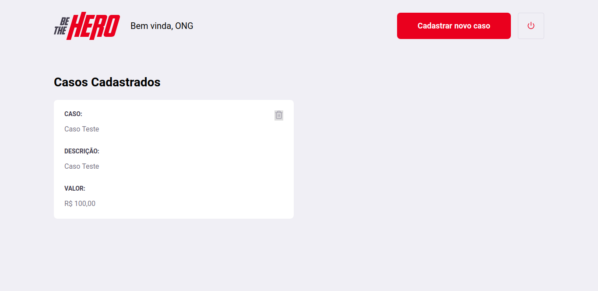
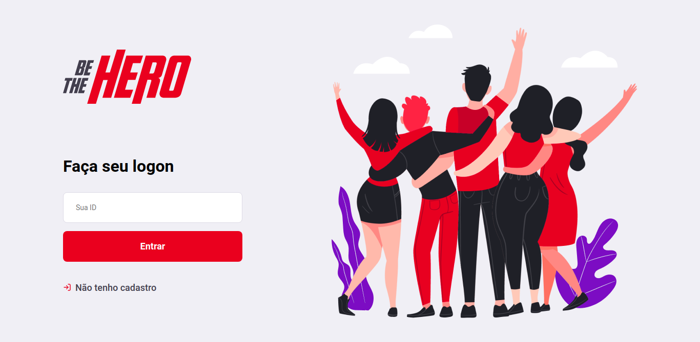

# Aplicação Web e mobile (Be The Hero) criada durante a semana OmniStack 11.0 💻🚀🚀

Durante essa semana desenvolvemos uma aplicação web (Front-end e Back-end
integrado com uma API RESTFul) e mobile chamada "Be The Hero" que tem como
intuito o cadastro de ONG's e seus respectivos casos, buscando voluntáros 
a arcar com os valores referente ao custo de cada caso, no desenvolvimento 
foram utilizadas diversas tecnologias e ferramentas como : 

	✔Node JS
	✔React JS
	✔React Native
	✔Nodemon 
	✔Insomnia
	✔Visual Studio Code
	✔SQLite
	✔Crypto
	✔Query builder Knex
	✔Cors
	✔Client HTTP Axios
	✔Expo
	✔Celebrate
	✔Joi
	✔Jest
	✔Cross
	✔Supertest

    
    
